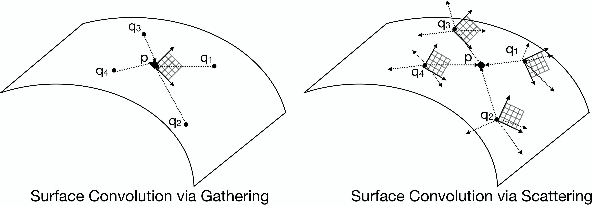

# FieldConv

The official implementation of field convolution from the ICCV 2021 paper and oral presentation.



## [[Paper: Field Convolutions for Surface CNNs]](https://arxiv.org/abs/2104.03916)

Field convolutions are highly discriminating, flexible, and straight-forward to implement. The goal of this repository is to provide the tools for incorperating field convolutions into arbitrary surface learning frameworks. 

## Contents
  - [Dependencies](#dependencies)
  - [Installation](#installation)
  - [Experiments](#experiments)
  - [Using field convolutions in your project](#using field convolutions in your project)
  - [Authorship and acknowledgements](#authorship and acknowledgements)

## Dependencies
- [PyTorch >= 1.9](https://pytorch.org)
- [PyTorch Scatter + PyTorch Geometric](https://pytorch-geometric.readthedocs.io/en/latest/notes/installation.html)
- [Progressbar2](https://pypi.org/project/progressbar2/)
- [Suitesparse](http://faculty.cse.tamu.edu/davis/suitesparse.html) (used for the Vector Heat Method)
- [CMake](https://cmake.org/)

Our implementation relies on PyTorch's support for complex numbers introduced in version 1.9. The majority of this code is not compatable with earlier PyTorch versions. PyTorch Geometric is used only for data pre-processing and PyTorch Scatter is used in the convolution modules. Suitesparse + CMake are used for building the fcutils extension used in data pre-processing.

## Installation
Clone this repository and its submodules
```
$ git clone --recurse-submodules https://github.com/twmitchel/FieldConv.git
```
Data pre-processing makes use of the `fcutils` python module, a binding exposing C++ routines from [Geometry Central](https://geometry-central.net) (for computing log maps, transport, etc. on meshes) and a few other routines.

The module is installed with pip by running the following command in the main directory:
```
$ pip install ./fcutils
```

## Experiments
This repository contains four Jupyter Notebooks which can be run to replicate the individual experiments in the paper. If either citing our results on these benchmarks or using/repurosing any of these experiments in your own work, please remember to cite the authors of the original datasets included below.

#### Shape Classification
Create the subdirectory 
```
/data/SHREC11/raw/
```
then download the [SHREC '11 Shape Classification dataset](https://www.cs.jhu.edu/~misha/Code/FieldConvolutions/SHREC11.zip) [1] and place the `SHREC11.zip` file in the above subdirectory. 
Afterwards, run the `classification.ipynb` notebook in the root directory. ([Original dataset](https://www.nist.gov/itl/iad/shrec-2011-shape-retrieval-contest-non-rigid-3d-watertight-meshes))

#### Shape Segmentation
Create the subdirectory
```
/data/SHAPESEG/raw/
```
then download the [Composite Humanoid Shape Segmentation dataset](https://www.cs.jhu.edu/~misha/Code/FieldConvolutions/SHAPESEG.zip) [2] and place the `SHAPESEG.zip` file in the above subdirectory.
Afterwards, run the `segmentation.ipynb` notebook in the root directory. ([Original dataset](https://github.com/Haggaim/ToricCNN))

#### Dense Correspondence
Create the subdirectory
```
/data/FAUSTRM/raw/
```
then download the [remeshed FAUST dataset](https://www.cs.jhu.edu/~misha/Code/FieldConvolutions/FAUSTRM.zip) [3, 4] and place the `FAUSTRM.zip` file in the above subdirectory.
Afterwards, run the `correspondence.ipynb` notebook in the root directory. ([Original dataset](http://faust.is.tue.mpg.de/) | [Remeshed](https://github.com/LIX-shape-analysis/GeomFmaps))

#### Feature Matching
We have contacted the authors of the [Isometric and Non-Isometric Shape Correspondence Benchmark dataset](https://shrec19.cs.cf.ac.uk/) [5] and they plan to make the ground truth correspondences publicly available. We will provide instructions on how to organize and pre-process the dataset so our experiments can be replicated. 

#### References
<small>[1] Zhouhui Lian et al. 2011. SHREC ’11 Track: Shape
Retrieval on Non-rigid 3D Watertight Meshes. Eurographics Workshop on 3D Object
Retrieval.
 
[2] Haggai Maron, Meirav Galun, Noam Aigerman, Miri Trope, Nadav Dym, Ersin Yumer,
Vladimir G Kim, and Yaron Lipman. 2017. Convolutional neural networks on surfaces
via seamless toric covers. ACM Trans. Graph 36, 4 (2017). 
 
[3] Federica Bogo, Javier Romero, Matthew Loper, and Michael J. Black. 2014. FAUST:
Dataset and evaluation for 3D mesh registration. In CVPR. IEEE.
 
[4] Nicolas Donati, Abhishek Sharma , and Maks Ovsjanikov. 2020. Deep geometric functional maps:
Robust feature learning for shape correspondence. In CVPR. IEEE.
 
[5] Roberto M. Dyke et al. 2019. Shape Correspondence with Isometric and Non-Isometric Deformations.
Eurographics Workshop on 3D Object Retrieval.
</small>

<hr/>

## Using field convolutions in your project
Below is a brief outline of how to use field convolutions to analyze 3D shape data. Further examples can be found in the experiment notebooks, and a detailed explantion of parameters and function inputs can be found in the files themselves.

That said, we'd be more than happy to take the time to work with you so you can put field convolutions to use in your application. If you need help, have any questions, comments, ideas, or insights you'd like to share, please don't hesistate to create an issue/discussion or reach out to us directly at `tmitchel` at `jhu` dot `edu`.


### Precomputation
Unlike Euclidean space, surfaces have no canonical coordinate system. As such, we need to precompute a few geometric quantities -- such as logarithmic maps and transport -- specific to the shape data we're planning to use. This implementation assumes we're working with triangle meshes. Once the mesh has been loaded into a PyToch Geometric `data` object, we apply the `SupportGraph` and `computeLogXPort` transformations to compute the filter support edges and geometric quantities needed to apply field convolutions. Any desired intrinsic normalization steps (such as normalizing meshes to have unit surface area, etc.) should usually be applied before the two aforementioned transformations.

```python
from torch_geometric.io import read_obj, read_ply
import torch_geometric.transforms as T
from transforms import SupportGraph, computeLogXPort, NormalizeArea

## Hyperparameters

# Filter support radius
epsilon = 0.2;

# Number of sample points
n_samples = 2048

## Initalize precomputation transform object
# Normalize meshes to have unit surface area
# Sample points on meshes and compute convolution support edges
# Compute logarithm maps + parallel transport

pre_transform = T.Compose((
    NormalizeArea(), 
    SupportGraph(epsilon=epsilon, sample_n=sample_n),
    computeLogXPort(),
    NormalizeAxes()
))


## Load the mesh
data = read_ply('/path/to/the/mesh.ply')

## Apply the transformations and return a new data object containing the precomputed quantities
data = pre_transform(data)

## Iterate this process, and save the list of data objects to be read by the dataloader
```

### Field convolutions in your network
The best place to start when applying field convolutions is to use an `FCResNetBlock` -- two field convolutions, followed by non-linearities with a residual connection between the input and output. Aside from the number of channels, the principle way to control parameter complexity is via the filter's angular `band_limit` and number of radial samples (`n_rings`). Information about additional parameters can be found in the `/nn/FCResNetBlock.py` file.

If you're using scalar features, we reccomend using the `LiftBlock` to transform them to an equivariant tangent vector feature field, though you can also use a linear layer. Similarly, depending on your application you may want to use an `ECHOBlock` at the end of the network to convert the tangent vector features back to scalar features. More information about each can be found in the supplement and paper, respectively, in addition to the files themselves.

At run time, we apply another transformation that organizes the precomputed quantities to expidite calculations and minimize memory footprint. You'll also want to make sure that the input features are defined at the sampled points (`data.sample_index` contains the indices of the vertices subsampled during precomputation). The following snippet gives an example of a simple network using field convolutions for a labeling task which takes the 3D positions of vertices as input features.

```python
## If you don't want to use the learnable 'gradient'
import torch
import torch.nn.functional as F

## Field convolution modules
from nn import FCResNetBlock, LiftBlock, ECHOBlock

## Organization transform
from transforms import FCPrecomp

## Differentiable feature magnitude
from utils.field import softAbs

## Hyperparameters

# Filter support radius: the same value used for precomputation
epsilon = 0.2; 

# Band-limit for field convolution filters
band_limit = 2

# Number of radial samples
n_rings = 6

# Number of channels in the network
nf = 32

# Number of output classes
n_classes = 8

## Network

class Net(torch.nn.Module):
    def __init__(self):
        super(Net, self).__init__()

        ## Organizes edge data at run time to expidte convolutions
        organizeEdges = FCPrecomp(band_limit=band_limit, n_rings=n_rings, epsilon=epsilon)

        ## Learned 'gradient', lifting scalar features to tangent vector features
        ## at the beginning of the network
        
        self.lift = LiftBlock(3, nf, n_rings=n_rings)
        
        # In case you don't want to use the learnable 'gradient'
        self.linIn = torch.nn.Linear(3, 2*nf)
        
        ## Field convolution Res-Net blcoks 

        self.resnet1 = FCResNetBlock(nf, nf, band_limit=band_limit, n_rings=n_rings)
    
        self.resnet2 = FCResNetBlock(nf, nf, band_limit=band_limit, n_rings=n_rings)

        # ECHO block - tangent vector features are used to compute  scalar ECHO descriptors which are then fed through an MLP
        self.echo = ECHOBlock(nf, n_classes, band_limit=band_limit)
        
        # In case you don't want to use the ECHO block
        self.linOut = torch.nn.Linear(nf, n_classes)
 
        
    def forward(self, data):
        
        ##########################
        ### Organize edge data ###
        ##########################
        
        supp_edges, supp_sten, ln, wxp = organizeEdges(data)
        
        attr_lift = (supp_edges, supp_sten[..., band_limit:(band_limit+2)])
        attr_conv = (supp_edges, supp_sten)
        attr_echo = (supp_edges, supp_sten, ln, wxp)
        
        
        #############################################
        ### Lift scalar features to vector fields ###
        #############################################
        
        x = data.pos[data.sample_idx, :]
        
        x = self.lift(x, *attr_lift)
        
        # If you don't want to use the learnable gradient operation,
        # you could try something like the following
        
        # x = torch.view_as_complex( torch.reshape(F.relu(self.linIn(x)), (-1, nf, 2));
        
        ##########################
        ### Field Convolutions ###
        ##########################
        
        x = self.resnet1(x, *attr_conv)

        x = self.resnet2(x, *attr_conv)
 
        #######################################################
        ### Compute ECHO descriptors and output predictions ###
        #######################################################
        
        return self.echo(x, *attr_echo)
        
        # If you don't want to use the ECHO block, 
        # try throwing the feature magnitudes in a linear layer
        
        # return self.linOut( softAbs(x) );
        
```


## Authorship and acknowledgements

Author: Thomas (Tommy) Mitchel (tmitchel 'at' jhu 'dot' edu)

Please cite our paper if this code or our method contributes to a publication:
```
@article{mitchel2021field,
  title={Field Convolutions for Surface CNNs},
  author={Mitchel, Thomas W and Kim, Vladimir G and Kazhdan, Michael},
  journal={arXiv preprint arXiv:2104.03916},
  year={2021}
}
```

Much of this code is adapted from the publicly available code for [HSN](https://github.com/rubenwiersma/hsn) (Wiersma et al. 2020) which serves an excellent template for implementing equivariant surface networks. 
